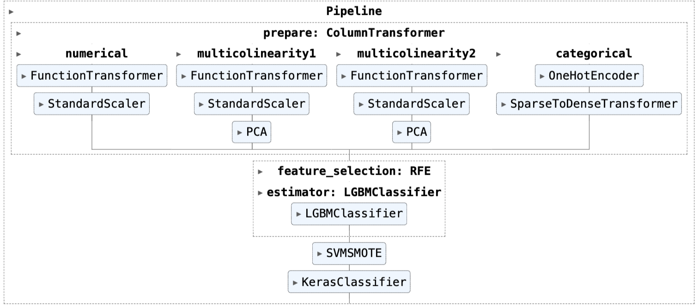
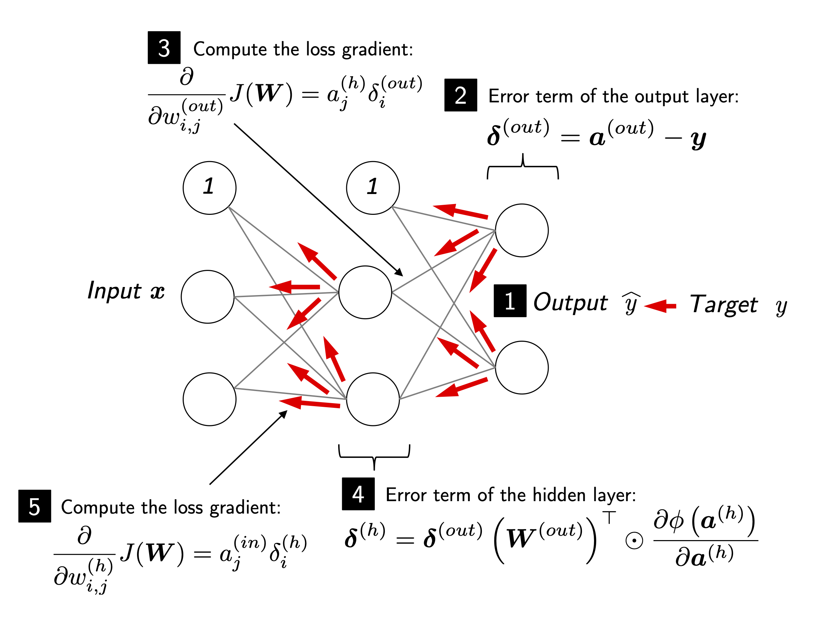

# Online-Shoppers-Purchasing-Intention
-- Yuanshan Zhang, Simiao Ye, Mengxin Zhao, Jiayun Liu

In this project, we applied a variety of ML classifiers to a binary classification problem - predicting whether a customer will purchase or not based on his/her page viewing data collected during an online shopping session. Models we used include: Logistic Regression, Random Forest, SVM, XG Boost, and MLP, and our goal is to recommend the model with
the best ability to distinguish between the positive and negative classes to minimize the cost of FPs (False Positives). Therefore, we used the roc_auc (receiver operating characteristic_area under curve) score as our evaluation metric.

## What I did
**1. EDA**\
First, I categorized categorical and numerical features. Then I visualized the target 'Revenue' and categorical features using bar plots and numerical features using pairplot and heatmap.

From the visualizations, I identified data issues such as class imbalance, multicollinearity, and the skewness of numerical features, and resolved these data issues correspondingly in the preprocessing pipeline I built.

**2. Building Pipeline**\
To ensure a simple, coherent, and repeatable data preprocessing and feature engineering process, I streamlined the workflow of feature engineering (i.e. scaling, transformation, and encoding), dimensionality reduction, and oversampling using the scikit-learn pipeline. 

**3. MLP**

Finally, I designed the MLP structure by searching over 30 combinations of hyper-parameters towards best ROC_AUC using BayesianOptimization:

- batch size: [32, 64, 128]
- number of layers: [2,3]
- number of neurons on each layer: 10 to 100, step=20
- activation: ['relu', 'tanh']
- dropout rate: 0.1 to 0.5, step=0.1

After fine-tuning, MLP gives the validation roc_auc of 0.934, which is the highest among all the models we built and fine-tuned:

| models | validation_roc_auc |
|-------|-------|
| Logistic Regression | 0.915 |
| Random Forest | 0.926 |
| SVM | 0.920 |
| XGBoost | 0.928 |
| MLP | 0.934 |
